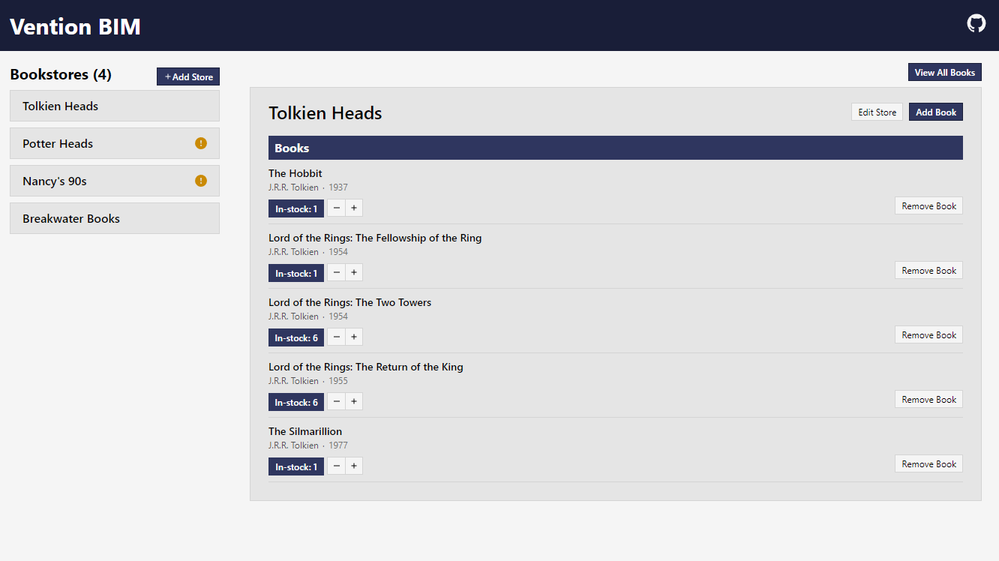

# Vention BIM (Book Inventory Management)

Book Inventory Management system for Vention take home project. Developed using Ruby on Rails 7, Hotwire, Vite, and WindiCSS.

Demo: <a href="https://vention.levimurray.dev" target="_blank">https://vention.levimurray.dev</a>

### Development Setup
```bash
# checkout repository
git clone https://github.com/levidavidmurray/vention-bim.git
cd ./vention-bim

# install dependencies
bundle && yarn install

# seed database
bundle exec rake db:setup db:migrate db:seed

# start server
bundle exec rails s
```

### Production Build
```bash
# build assets
bundle exec rake assets:precompile

# start server
bundle exec rails s -e production
```

<p align="center">
  
</p>
